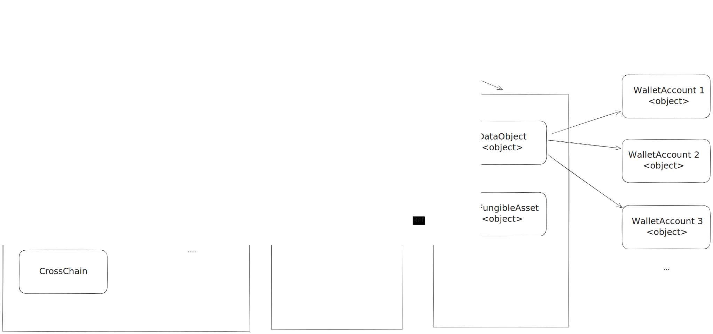

# MoneyFi Contract

## Architecture

## Development

# Package requirment
git clone --recurse-submodules https://github.com/circlefin/aptos-cctp.git cctp

### 1. Setup

- Init profile: `aptos init`
- Run `setup.sh` to download dependencies

### 2. Compile & testing

- `aptos move compile`
- `aptos move test`

### 3. Deployment

- Deploy: `aptos move deploy-object --address-name moneyfi`
- Upgrade: `aptos move upgrade-object --address-name moneyfi --object-address $DEPLOYED_ADDRESS`
